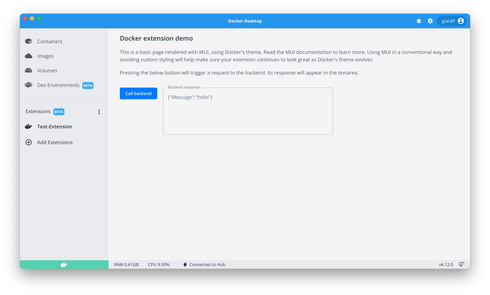

[](https://stores.kotisdesign.com/docker)
[](https://forums.docker.com/t/about-the-hacktoberfest-category/129061)


## Docker y Hacktoberfest 2022

¡Bienvenido al [Hacktoberfest 2022](https://hacktoberfest.digitalocean.com/) con las extensiones de Docker!

Hacktoberfest es una celebración de un mes de proyectos de código abierto, sus mantenedores y toda la comunidad de colaboradores. Este evento trata de retribuir a la comunidad y celebrar todo lo relacionado con el código abierto. Nos gustaría invitarte a celebrar el Hacktoberfest con nosotros y contribuir a las [Extensiones de la comunidad de Docker](https://www.docker.com/products/extensions/).

## Tabla de contenidos

-❓[¿Cómo participar?](#cómo-participar)
- ✔️ [Lista de extensiones de Docker para Hacktoberfest 2022](#lista-de-extensiones-docker-para-hacktoberfest-2022) 
- 🏗️ [Cómo construir tu primera extensión Docker](#cómo-construir-tu-primera-extensión-docker) 
- 🗣️ [Propón tu extensión Docker en la lista Hacktoberfest](#propón-tu-extensión-docker-en-la-lista-hacktoberfest)
- 💬 [Soporte y comunidad](#soporte-y-comunidad)

## ❓¿Cómo participar?

Para participar, hay dos formas principales en las que puedes contribuir:

1. Crea una nueva extensión propia de código abierto y agrégala a la lista a continuación.
2. Contribuye a cualquiera de las extensiones de código abierto existentes que se enumeran a continuación que permiten PRs (pull request) para Hacktoberfest.

Para participar en Hacktoberfest, todo lo que necesitas hacer es abrir [Pull Requests](https://github.com/docker/hacktoberfest-2022/pulls) en este repositorio o en cualquiera de los repositorios enumerados a continuación para unirte a Hacktoberfest, y obtén tu PR fusionado o aprobado.

Sabemos que crear su propia extensión puede parecer una gran tarea, por lo que aquí hay algunas pautas a tener en cuenta:

1. La extensión debe resolver un problema del usuario o ayudar a satisfacer una necesidad existente del usuario.
2. No es necesario que la extensión esté lista para producción al final del Hacktoberfest.
3. La extensión puede ser una idea o una prueba de concepto.

## ✔️Lista de extensiones Docker para Hacktoberfest 2022

Aquí hay una lista de repositorios de extensiones de Docker a los que puedes contribuir como parte del evento Hacktoberfest.

Puedes agregar su propia extensión en esta lista con tu propio repositorio de github.

| Name/Github Repo                                                                        | Category               | Status         | PRs welcome |
| --------------------------------------------------------------------------------------- | ---------------------- | -------------- | ----------- |
| [Volumes Backup & Share](https://github.com/docker/volumes-backup-extension)            | Utility                | In Marketplace | ✅          |
| [JFrog](https://github.com/jfrog/jfrog-docker-desktop-extension)                        | Security               | In Marketplace | ✅          |
| [Aventer Mini Cluster](https://github.com/AVENTER-UG/docker-mesos-extension)            | Cloud Infrastructure   | In Marketplace | ✅          |
| [DDosify](https://github.com/ddosify/ddosify-docker-extension)                          | Tests                  | In Marketplace | ✅          |
| [Lacework Scanner](https://github.com/l6khq/lacework-docker-extension)                  | Security               | In Marketplace | ✅          |
| [GOSH](https://github.com/gosh-sh/hacktoberfest2022/)                                   | Blockchain             | In Marketplace | ✅          |
| [Meshery](https://github.com/meshery/meshery/tree/master/install/docker-extension)      | Cloud Native Management| In Marketplace | ✅          |
| [Okteto](https://github.com/okteto/docker-desktop-extension)                            | Development Platform   | In Marketplace | ✅          |
| [RedHat OpenShift](https://github.com/redhat-developer/openshift-dd-ext)                | Development Platform   | In Marketplace | ✅          |
| [Postman](https://github.com/loopDelicious/docker-extension)                            | Tests                  | Community      | ✅          |
| [Github Registry](https://github.com/peacecwz/github-registry-docker-desktop-extension) | Image registry         | Community      | ✅          |
| [Swagger](https://github.com/n-murphy/swagger-editor-docker-extension)                  | Development Tools      | Community      | ✅          |
| [Drone](https://github.com/harness/drone-desktop-docker-extension)                      | Continuous Integration | Community      | ✅          |
| [Alfresco](https://github.com/AlfrescoLabs/alfresco-docker-extension)                   | Content management     | Community      | ✅          |
| [DDM](https://github.com/jatin711-debug/request-docker-extension)                       | Development tools      | Community      | ✅          |
| [Storj](https://github.com/elek/docker-storj-extension)                                 | Cloud Infrastructure   | Community      | ✅          |
| [Parseable](https://github.com/parseablehq/parseable-docker-extension)                  | Log Store & Observability| Community    | ✅          |
| [SuperTokens](https://github.com/supertokens/supertokens-core)                          | Authentication         | Community      | ✅          |
| [Swagger](https://github.com/n-murphy/swagger-editor-docker-extension) ([main product](https://github.com/n-murphy/swagger-editor)) | Development Tools | Community | ✅ |
| Add new extension to participate | | | |

## Lista de sugerencias de extensiones de Docker

Aquí hay una lista de sugerencias o ideas para las nuevas extensiones de Docker:

| Name/Github Repo                                        | Category                  |
| ------------------------------------------------------- | ------------------------- |
| [Dive Tool](https://github.com/wagoodman/dive)          | Utility                   |
| [Watchtower](https://github.com/containrrr/watchtower)  | Infrastructure/Automation |
| [Buildg](https://github.com/ktock/buildg)               | Debugging                 |
| [Mongo Express](https://hub.docker.com/_/mongo-express) | Database                  |
| [Popeye](https://github.com/derailed/popeye)            | Debugging                 |
| [Botkube](https://botkube.io/)                          | Monitoring/Debugging      |

## 🏗️Cómo construir tu primera extensión Docker

Consulte los pasos a continuación sobre cómo crear su primera extensión de Docker y cómo agregarla a la lista.

Al agregar una extensión, también puede especificar si acepta contribuciones de Hacktoberfest en su extensión, eso alentará a otras personas a participar y mejorar la extensión que propone.

Si tiene alguna pregunta, únase a nuestro [canal con la comunidad de Slack](https://dockercommunity.slack.com) #extensions.

## Creando tu primera extensión de Docker

Para comenzar, puedes crear tu primera extensión de Docker en minutos. Consulta los detalles en nuestra [Guía de inicio rápido](https://docs.docker.com/desktop/extensions-sdk/quickstart/).

En pocas palabras:

- Si aún no has instalado Docker Desktop, [instale Docker Desktop](https://www.docker.com/products/docker-desktop/).
- en una terminal, escribe

```
docker extension init my-extension
```

Te pedirá un nombre de imagen de Docker para su extensión y algunos detalles. Esto generará una extensión hello-world con una interfaz de usuario básica y un servicio de backend conectado (opcional).

- navega hasta la carpeta generada y escribe

```
make install-extension
```

para compilar e instalar la extensión generada.

- Abre Docker Desktop Dashboard y prueba la extensión navegando a la pestaña `Test-Extension`. ¡Ya tienes una extensión activa!



## 🗣️Propón tu extensión Docker en la lista Hacktoberfest

- Una vez que tengas un repositorio de GitHub para tu extensión, edita `README.md` y describe tu extensión, el problema o las necesidades del usuario que resuelve.
- Push el nuevo repositorio de Git a tu cuenta de GithHub

```
 git remote add origin https://github.com/my-account/my-extension.git
 git push -u origin main
```

- Fork https://github.com/docker/hacktoberfest-2022 repositorio
- En tu clon local del repositorio `docker/harcktoberfest`, agrega tu extensión en la lista (en `README.md`). No olvides incluir:
   - nombre de la extensión y una descripción de una línea
   - repositorio de Github para la descripción
   - estado de la extensión que agregas: `idea` (si no has comenzado a codificar realmente la extensión), `Comunidad` (se ha iniciado algún código), `funcional` (la funcionalidad está implementada)
   - especifica si aceptas PR de otros participantes del Hacktoberfest (utiliza la etiqueta `hacktoberfest` en tu repositorio de git)
- Aplica commit a tus cambios y push en la rama en tu fork local, y crea unPull Request en docker/harcktoberfest con tu rama

## 📹Vídeos

| Cómo construir tu primera extensión de Docker                                                                                                                                             | Creación de la extensión Docker desde cero                                                                                                                                                        |
| ---------------------------------------------------------------------------------------------------------------------------------------------------------------------------------------- | --------------------------------------------------------------------------------------------------------------------------------------------------------------------------------------------- |
| [](https://www.youtube.com/watch?v=Fu6BuqJ4MtE) | [](https://www.youtube.com/watch?v=HqCnOhbcobE) |

|Introducción a las extensiones de Docker                                                                                                                                                              | ¿Qué son las extensiones Docker?                                                                                                                                                        |
| ------------------------------------------------------------------------------------------------------------------------------------------------------------------------------------------ | --------------------------------------------------------------------------------------------------------------------------------------------------------------------------------- |
| [](https://www.youtube.com/watch?v=BHKp7Sc3VVc&t=420s) | [](https://www.youtube.com/watch?v=zfDSFw9Z8YY) |

## 💬Soporte y comunidad

Si tienes el suficiente interés para crear una extensión de Docker, el equipo de Docker está disponible para ayudarte.
Puedes encontrarnos en el [Foro de Docker](https://forums.docker.com/t/about-the-hacktoberfest-category/129061), publicar issues en nuestro [Repo SDK](https://github.com/docker/extensions-sdk), o comunicarte con nosotros a través del correo electrónico extensions(AT)docker.com.

## Referencias:

- [Introduction to Docker Extensions](https://docs.docker.com/desktop/extensions/)
- [How to create your own Docker Extensions](https://docs.docker.com/desktop/extensions-sdk/)
- [Create Your First Extensions](https://docs.docker.com/desktop/extensions-sdk/tutorials/initialize/)
- [Minimal frontend extensions tutorial](https://docs.docker.com/desktop/extensions-sdk/tutorials/minimal-frontend-extension/)
- [Minimal React Extensions tutorial](https://docs.docker.com/desktop/extensions-sdk/tutorials/react-extension/)
- [Minimal Docker CLI Extensions tutorial](https://docs.docker.com/desktop/extensions-sdk/tutorials/minimal-frontend-using-docker-cli/)
